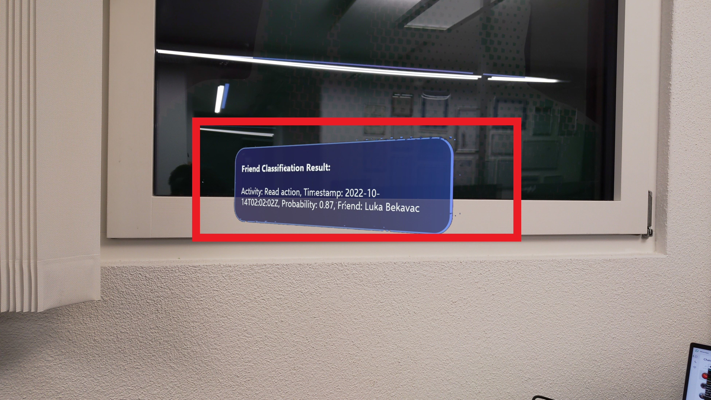
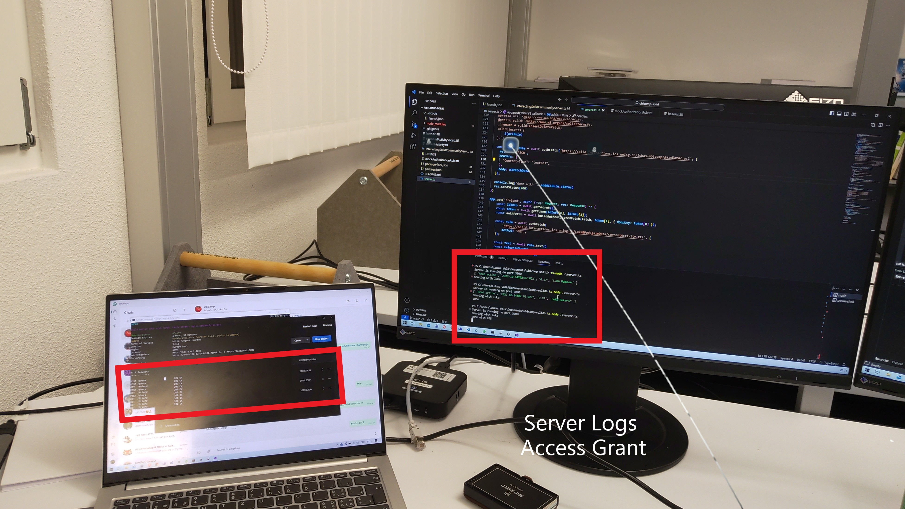
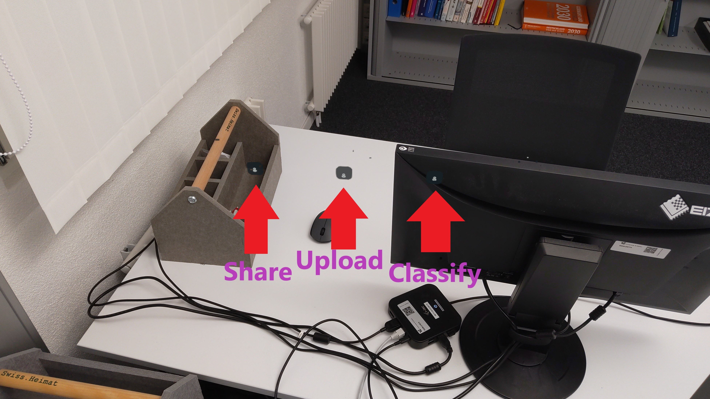

# ubicomp-solid

[Github](https://github.com/Scraylex/ubicomp-solid) helps view the images better!

## Task 4

In Solid, data access is managed using Access Control Lists (ACLs) to regulate permissions and define rules. The rules regulate who and which actions can be performed by a specific person on a specific resources within a Solid Pods. Solid Pods are personal online data stores thus always owned by a certain non-information entity. The solid pod acts as the entry point for the information resource of this non-information entity.

Having given access to a certain resource with the supplied example or something like the following snippet.

Example Snippet:
```
<https://example.com/resource> acl:accessTo <https://example.com/resource>;
                               acl:agent <https://alice.example/profile/card#me>;
                               acl:mode  acl:Read, acl:Write.
```

certain agents can be allowed access to certain containers and their containing resources or only individual resources within a container under a variety of possible access modes. These access modes are Control, Read, Write, Append and function as their names entail. This is interesting for various scenarios like CRDTs or in general for granting fine grained permissions to resources.

We could obviously access the resources to which new rules for the respective users where added. This allowed me to access the gazeData and hobbies of everyone in the group.

Subsequently where access was not granted none was to be had. The solid pod responds with a 403 Forbidden status accordingly. The 403 Forbidden HTTP status code semantically implies that you cannot and will not access the specified existing resources because you are not allowed. It thus expresses the existence of the resource and the requestors permanently missing permissions. This is different to a 401 Unauthorized, which implies that an authorization action can be taken to access the resource, or a 400 Bad Request which implies invalid input data contained in the request.

## Task 5

Screenshots





## Pitfalls

- Unity was a little buggy with an existing GameObject not being accepted
- One now has 3 running services which comes with the regular problems of multiple services, especially with tunneling over an ethereal tunnel and forgetting to adjust the URLs. In essence a lot of moving parts are always difficult to handle
- Solid Server works in mysterious ways sometimes. Dpop Verification worked easily under Linux but had time sync bugs under windows (Maybe due to dual booting idk).
- Solid WAC specification could give some direct examples
- Differences in inbuilt logic between n3 and turtle for the creation of the acl rules had to be thought about
- Solid documentation in general needs to be more explicit for users and easier to use. The inrupt library is already a good start but with powerful tools there need to be understandable abstractions